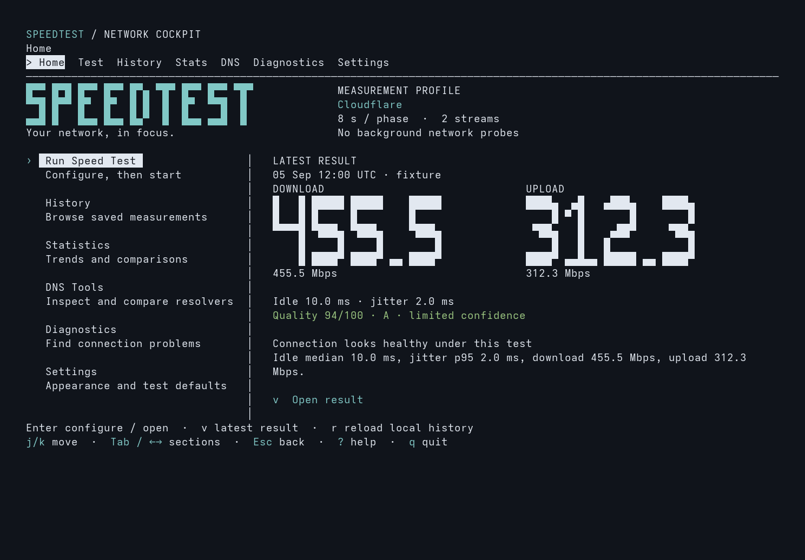
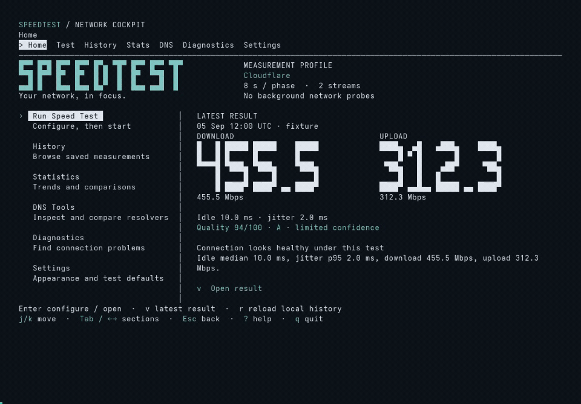
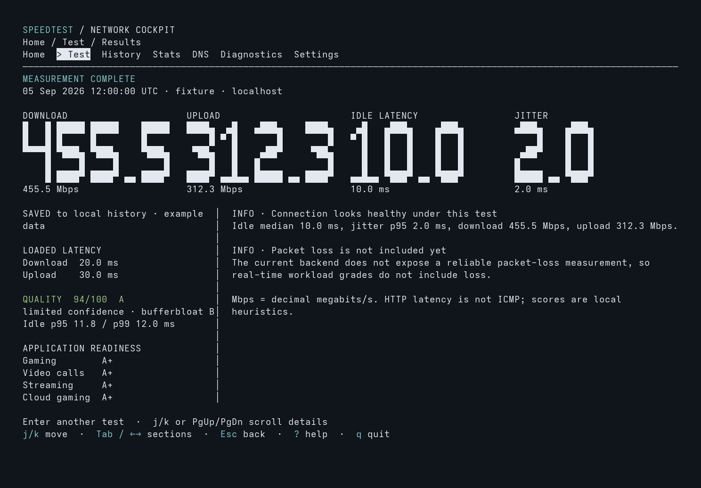
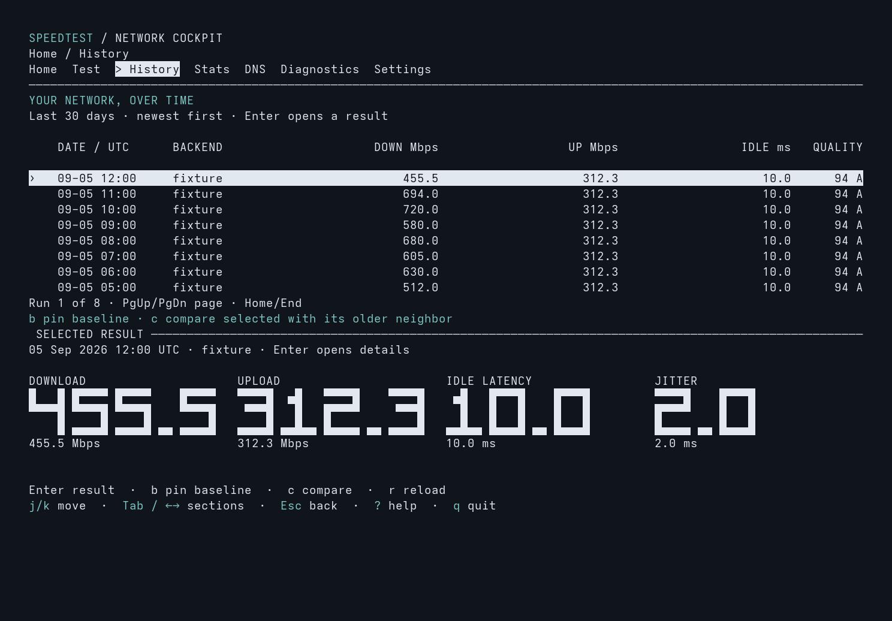
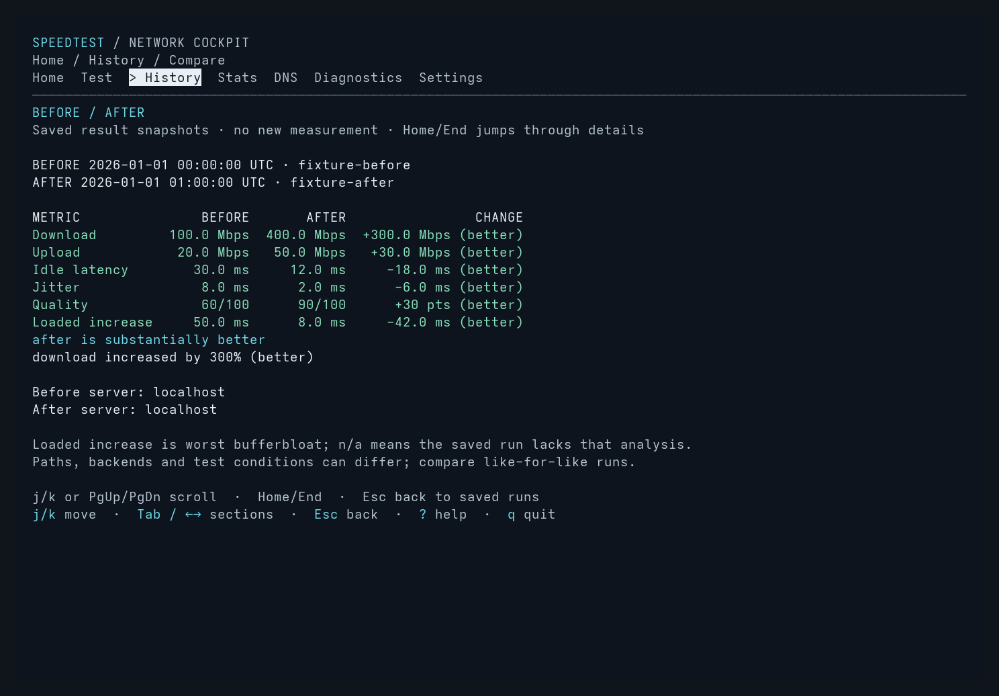

<h1 align="center">speedtest-cli</h1>

<p align="center">
  <strong>Know your speed. Understand your connection.</strong><br>
  A terminal network lab for throughput, latency, bufferbloat, DNS, and connection history.<br>
  Built with Rust. Keyboard driven. Ready for scripts.
</p>

<p align="center">
  <a href="https://github.com/cmdr-chara/speedtest-cli/releases/latest"></a>
  <a href="https://github.com/cmdr-chara/speedtest-cli/actions/workflows/ci.yml"></a>
  <a href="./LICENSE"></a>
</p>

<p align="center">
  <a href="https://github.com/cmdr-chara/speedtest-cli/releases/latest"><strong>Download</strong></a>
  &nbsp;•&nbsp;
  <a href="#get-started">Get started</a>
  &nbsp;•&nbsp;
  <a href="#see-it-in-action">Screenshots</a>
  &nbsp;•&nbsp;
  <a href="./docs/usage.md">User guide</a>
  &nbsp;•&nbsp;
  <a href="https://github.com/cmdr-chara/speedtest-cli/issues">Get help</a>
</p>

<p align="center">
  
</p>

<p align="center"><sub>Current development UI, captured from the application's renderer with illustrative test data. These are not measured connection speeds; published releases may differ.</sub></p>

## Why speedtest-cli?

A fast connection can still struggle with calls or games. speedtest-cli puts throughput beside latency under load, explains the result, and lets you compare it with earlier runs.

- **See more than Mbps.** Measure download, upload, idle and loaded latency, jitter, and bufferbloat, with an explained quality score and workload grades.
- **Find where performance changes.** Cross-check Cloudflare and LibreSpeed, inspect Wi-Fi, or test between two machines on your LAN.
- **Keep a useful history.** Browse saved runs, spot trends, pin a baseline, and compare six metrics before and after a change.
- **Investigate DNS and stability.** Inspect resolvers, benchmark UDP or DoH, monitor HTTP availability, and measure ICMP echo response loss separately.
- **Use it your way.** An offline home dashboard, eight languages, four palettes, and plain text, JSON, and CSV for automation.

## Download

Download a native archive from [GitHub Releases](https://github.com/cmdr-chara/speedtest-cli/releases/latest). **Rust is not required** to run a prebuilt binary.

| Your computer | Package |
| --- | --- |
| Windows · Intel / AMD 64-bit | [speedtest-windows-x86_64.zip](https://github.com/cmdr-chara/speedtest-cli/releases/latest/download/speedtest-windows-x86_64.zip) |
| Linux · Intel / AMD 64-bit | [speedtest-linux-x86_64.tar.gz](https://github.com/cmdr-chara/speedtest-cli/releases/latest/download/speedtest-linux-x86_64.tar.gz) |
| macOS · Apple Silicon | [speedtest-macos-aarch64.tar.gz](https://github.com/cmdr-chara/speedtest-cli/releases/latest/download/speedtest-macos-aarch64.tar.gz) |
| macOS · Intel | [speedtest-macos-x86_64.tar.gz](https://github.com/cmdr-chara/speedtest-cli/releases/latest/download/speedtest-macos-x86_64.tar.gz) |

Each archive has a matching `.sha256` file on the release page. Extract the archive and launch `speedtest` (`speedtest.exe` on Windows).

<details>
<summary><strong>Installation commands for Windows, Linux, and macOS</strong></summary>


GitHub Releases are the recommended installation method; Rust is not required.

#### Windows x86_64

```powershell
Invoke-WebRequest -Uri "https://github.com/cmdr-chara/speedtest-cli/releases/latest/download/speedtest-windows-x86_64.zip" -OutFile speedtest.zip
Expand-Archive .\speedtest.zip -DestinationPath . -Force
.\speedtest-windows-x86_64\speedtest.exe
```

#### Linux x86_64

```bash
curl -L "https://github.com/cmdr-chara/speedtest-cli/releases/latest/download/speedtest-linux-x86_64.tar.gz" -o speedtest.tar.gz
tar -xzf speedtest.tar.gz
sudo install -m 0755 speedtest-linux-x86_64/speedtest /usr/local/bin/speedtest
speedtest
```

The Linux release uses musl for broad distribution compatibility.

#### macOS

```bash
case "$(uname -m)" in
  arm64) ASSET="aarch64" ;;
  x86_64) ASSET="x86_64" ;;
  *) echo "Unsupported architecture: $(uname -m)"; exit 1 ;;
esac

curl -L "https://github.com/cmdr-chara/speedtest-cli/releases/latest/download/speedtest-macos-${ASSET}.tar.gz" -o speedtest.tar.gz
tar -xzf speedtest.tar.gz
sudo install -m 0755 "speedtest-macos-${ASSET}/speedtest" /usr/local/bin/speedtest
```

Each packaged release includes SHA-256 checksum files.


</details>

<details>
<summary><strong>Build the current checkout</strong></summary>

Requires the current stable Rust toolchain. From the repository directory:

```bash
cargo build --release --locked --bin speedtest
cargo run --release --locked --bin speedtest
```

The executable is written to `target/release/speedtest` (`speedtest.exe` on Windows).
See [CONTRIBUTING.md](./CONTRIBUTING.md) for development and verification instructions.

</details>

## Get started

```bash
speedtest                         # Open the dashboard
speedtest --run                   # Start a test immediately
speedtest --backend librespeed    # Open with LibreSpeed selected
speedtest --plain                 # Run with plain text output
speedtest --json                  # Run with JSON output
```

1. Open `speedtest` in a terminal of at least **80 × 24** characters.
2. Choose **Run Speed Test** and review the backend, duration, and streams.
3. Start the test, then review throughput, latency, and connection quality.
4. Open **History** to revisit a run or compare it with an earlier baseline.

Opening the interactive dashboard reads local history only. Network operations begin when you start them. Completed tests are saved locally unless you use `--no-save`.

| Key | Action |
| --- | --- |
| `↑` / `↓` or `k` / `j` | Select or scroll |
| `Enter` | Open or confirm |
| `Tab` / `Shift+Tab` | Switch sections |
| `Esc` | Go back |
| `b` / `c` in History | Pin a baseline / compare |
| `?` / `q` | Keyboard guide / quit |

[Full keyboard guide and cockpit behavior →](./docs/usage.md#network-cockpit)

## See it in action

### Watch the connection under load

The live dial shows throughput alongside latency readings as the test progresses.

<p align="center">
  
</p>

### Explore results and history

Browse saved tests, pin a baseline, compare it with another run, and open the full result.

<p align="center">
  
</p>

<details>
<summary><strong>View static result and comparison screenshots</strong></summary>

Review the exact numbers, quality grade, bufferbloat, and findings in one place.

<p align="center">
  
</p>

Select a saved run and press `b` to pin it. Select another run and press `c` to compare download, upload, latency, jitter, quality, and bufferbloat.

<p align="center">
  
</p>

<p align="center">
  
</p>

</details>

<details>
<summary><strong>Choose your language and appearance</strong></summary>

English, Italian, Spanish, French, German, Portuguese, Simplified Chinese, and Japanese are available in **Settings → Language**, or with `speedtest --language it`.

Choose Terminal (adaptive), Graphite, Light, or Monochrome, and Comfortable or Compact layouts. Settings apply to the current session. Use your terminal's font-size controls to enlarge all text; the interface reflows with the window.

[Language and readability guide →](./docs/usage.md#interface-language-and-text-size)

</details>

All gallery images use deterministic fixtures rendered by the current application. [Capture details →](./docs/images/readme/README.md)

## A network lab in one command

| What you want to learn | Command |
| --- | --- |
| Do two Internet backends agree? | `speedtest verify` |
| Is the local network the bottleneck? | `speedtest serve --bind 192.168.1.50:9876` on one machine, then `speedtest lan 192.168.1.50:9876` on another |
| What does the network diagnosis show? | `speedtest doctor` |
| How is the Wi-Fi link configured? | `speedtest wifi` |
| Are ICMP echo responses being lost? | `speedtest loss --target 1.1.1.1 --count 50` |
| Does HTTP availability stay consistent? | `speedtest stability --duration 5m` |
| Which DNS resolvers respond well? | `speedtest dns benchmark --protocol doh` |
| How has the connection changed? | `speedtest history` / `speedtest stats` / `speedtest compare` |

LAN mode is unauthenticated and unencrypted; bind only on a trusted network and do not expose it to the Internet. HTTP availability and ICMP loss describe different behavior. Quality grades are explained local heuristics, not certifications. [Measurement semantics and limitations →](./docs/usage.md#accuracy-notes)

DNS inspection and benchmarks are read-only. Configuration commands such as `dns set` and `dns optimize` change system settings; preview with `--dry-run` and read the [DNS and recovery guide](./docs/usage.md#dns-suite) first.

## Made for scripts, too

Export a result, then check it offline against your own thresholds:

```bash
speedtest --json --no-save > result.json
speedtest check result.json --min-download 100 --min-upload 20 --max-latency 30
```

A passing check exits **0**; failed thresholds exit **3**. JSON uses stable field names and units across interface languages. CSV export is available with `--output result.csv --format csv`.

Read the [automation contract](./docs/usage.md#terminal-and-automation-behavior), [offline checks](./docs/usage.md#offline-checks-for-scripts), and [storage guarantees](./docs/usage.md#data-storage) for errors, cancellation, output streams, and concurrent jobs.

## Documentation and contributing

- [User guide](./docs/usage.md) — commands, installation, keyboard controls, DNS, result semantics, and storage.
- [Contributing](./CONTRIBUTING.md) — build, test, and verification workflow.
- [Architecture](./docs/network-cockpit.md) — cockpit state, services, and rendering.
- [Verification reports](./docs/verification.md) — recorded checks and remaining limitations.
- [Report an issue](https://github.com/cmdr-chara/speedtest-cli/issues) — include the command, platform, and relevant output.

speedtest-cli is an independent project, not an official Cloudflare or LibreSpeed client.

## License

[speedtest-cli Source Available License 1.0](./LICENSE).

Personal use and internal business use are permitted. Redistribution must include
corresponding source under the same terms. Modified versions operated for remote
users must offer those users their corresponding source. Selling copies, bundling
into paid products, or providing paid services based on the tool requires separate
written permission. See LICENSE for the definitions and full conditions.

This is a custom source-available license, not AGPL or an OSI-approved open-source
license. It applies from the revision introducing it; it does not revoke MIT rights
for previously published material. The existing v0.6.0 release and its downloads
remain under MIT. The package version is still 0.6.0; identify the source revision
as well as the version when checking licensing.

Request commercial permission through [GitHub](https://github.com/cmdr-chara/speedtest-cli/issues).
Do not include confidential or personal information in a public request.
