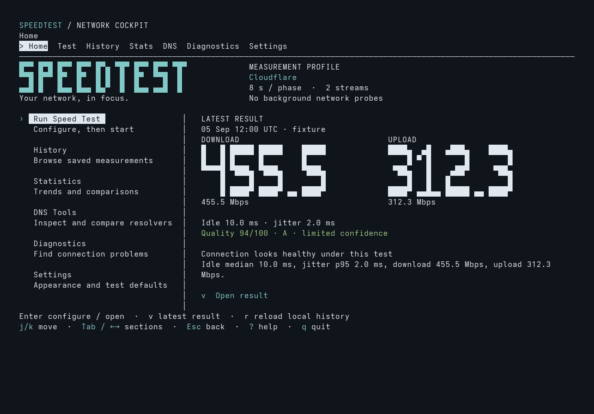
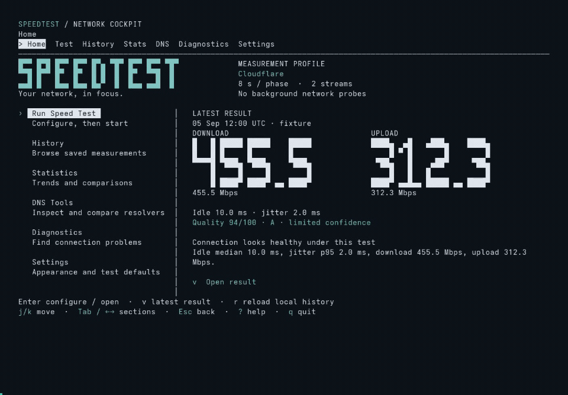
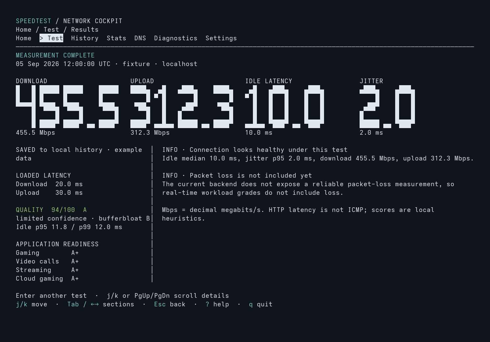
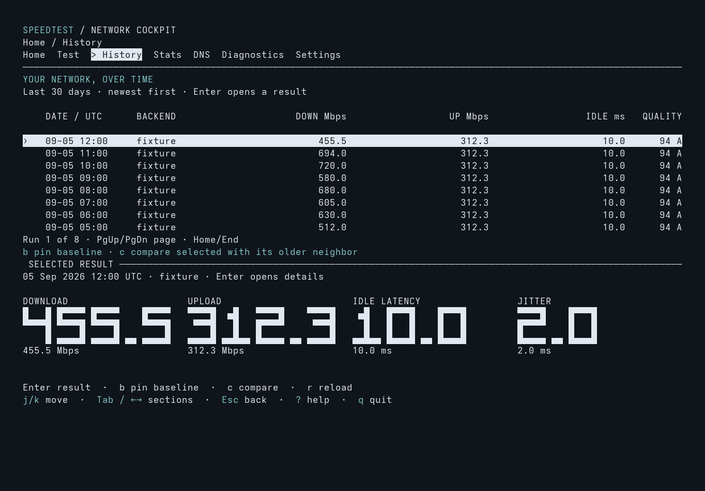
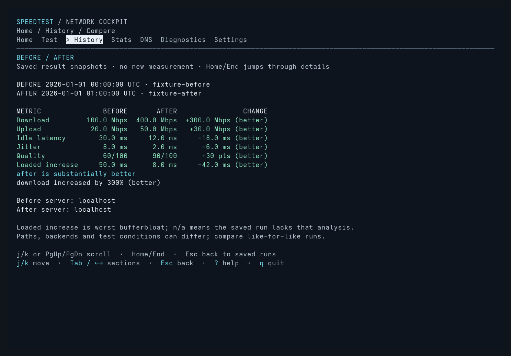

# speedtest-cli

> **Know your speed. Understand your connection.**

`speedtest-cli` is a terminal network lab for measuring the connection you actually use—not just a headline Mbps number. It shows throughput, latency under load, jitter, bufferbloat, DNS behavior, stability, and local network performance in one keyboard-friendly tool.

<p align="center">
  <a href="https://github.com/cmdr-chara/speedtest-cli/releases/latest"></a>
  <a href="https://github.com/cmdr-chara/speedtest-cli/actions/workflows/ci.yml"></a>
  <a href="./LICENSE"></a>
</p>

<p align="center">
  <a href="#install">Install</a>
  &nbsp;•&nbsp;
  <a href="#run-your-first-test">First test</a>
  &nbsp;•&nbsp;
  <a href="#useful-commands">Commands</a>
  &nbsp;•&nbsp;
  <a href="#license-in-plain-english">License</a>
  &nbsp;•&nbsp;
  <a href="./docs/usage.md">User guide</a>
</p>

<p align="center">
  
</p>

<p align="center"><sub>Current development UI, captured from the application's renderer with illustrative test data. These are not measured connection speeds; published releases may differ.</sub></p>

## Why use it?

Most speed tests stop at download and upload. `speedtest-cli` helps answer the questions that matter when a video call stutters, a game lags, or Wi-Fi feels slow:

- **Is the connection fast and responsive?** Measure download, upload, idle and loaded latency, jitter, bufferbloat, and a quality score with workload grades.
- **Where is the bottleneck?** Compare Internet backends, inspect Wi-Fi, or test directly between two machines on your LAN.
- **Did something change?** Search and sort saved runs, isolate Internet or LAN paths, pin a baseline, and explore six statistics metrics without leaving the cockpit.
- **Is the network reliable?** Inspect DNS, benchmark UDP, DoH, DoT, or DoQ, monitor repeated runs, and measure ICMP response loss separately.
- **Do I need a script?** Filter and export history as JSON, CSV, or JSONL, or publish an offline Prometheus textfile with a freshness check.

## Install

### Download a release

Prebuilt archives are the easiest option. **Rust is not required** to run one.

| Platform | Download |
| --- | --- |
| Windows · Intel / AMD 64-bit | [speedtest-windows-x86_64.zip](https://github.com/cmdr-chara/speedtest-cli/releases/latest/download/speedtest-windows-x86_64.zip) |
| Linux · Intel / AMD 64-bit | [speedtest-linux-x86_64.tar.gz](https://github.com/cmdr-chara/speedtest-cli/releases/latest/download/speedtest-linux-x86_64.tar.gz) |
| macOS · Apple Silicon | [speedtest-macos-aarch64.tar.gz](https://github.com/cmdr-chara/speedtest-cli/releases/latest/download/speedtest-macos-aarch64.tar.gz) |
| macOS · Intel | [speedtest-macos-x86_64.tar.gz](https://github.com/cmdr-chara/speedtest-cli/releases/latest/download/speedtest-macos-x86_64.tar.gz) |

Every release also includes a matching `.sha256` checksum. Extract the archive and run `speedtest` (`speedtest.exe` on Windows).

<details>
<summary><strong>Install commands</strong></summary>

#### Windows (PowerShell)

```powershell
Invoke-WebRequest -Uri "https://github.com/cmdr-chara/speedtest-cli/releases/latest/download/speedtest-windows-x86_64.zip" -OutFile speedtest.zip
Expand-Archive .\speedtest.zip -DestinationPath . -Force
.\speedtest-windows-x86_64\speedtest.exe
```

#### Linux (x86_64)

```bash
curl -L "https://github.com/cmdr-chara/speedtest-cli/releases/latest/download/speedtest-linux-x86_64.tar.gz" -o speedtest.tar.gz
tar -xzf speedtest.tar.gz
sudo install -m 0755 speedtest-linux-x86_64/speedtest /usr/local/bin/speedtest
speedtest
```

The Linux release uses musl for broad distribution compatibility.

#### macOS

```bash
case "$(uname -m)" in
  arm64) ASSET="aarch64" ;;
  x86_64) ASSET="x86_64" ;;
  *) echo "Unsupported architecture: $(uname -m)"; exit 1 ;;
esac

curl -L "https://github.com/cmdr-chara/speedtest-cli/releases/latest/download/speedtest-macos-${ASSET}.tar.gz" -o speedtest.tar.gz
tar -xzf speedtest.tar.gz
sudo install -m 0755 "speedtest-macos-${ASSET}/speedtest" /usr/local/bin/speedtest
speedtest
```

See the [latest release](https://github.com/cmdr-chara/speedtest-cli/releases/latest) for all available files and checksums.

Release assets also include generated Homebrew and WinGet metadata with the exact archive
checksums. They are submission-ready artifacts for package maintainers; the project does not
claim an official Homebrew tap or WinGet source until those external repositories accept them.

</details>

### Build from source

Building requires the current stable Rust toolchain:

```bash
git clone https://github.com/cmdr-chara/speedtest-cli.git
cd speedtest-cli
cargo build --release --locked --bin speedtest
./target/release/speedtest
```

See [CONTRIBUTING.md](./CONTRIBUTING.md) for development and verification instructions.

## Run your first test

```bash
speedtest                         # Open the interactive dashboard
speedtest --run                   # Start a test immediately
speedtest --plain                 # Human-readable terminal output
speedtest --json --no-save         # JSON output without writing history
speedtest --jsonl --no-save        # Live newline-delimited JSON events
```

The dashboard is safe to open and browse offline. Network activity starts only when you explicitly start a test or diagnostic. Completed tests are saved locally by default; add `--no-save` when you do not want to write a result.

For the interactive dashboard, use a terminal at least **80 × 24** characters:

1. Choose **Run Speed Test**.
2. Review the backend, duration, and stream settings.
3. Start the test and watch throughput and latency under load.
4. Open **History** to revisit a result or compare it with a baseline.

### Keyboard controls

| Key | Action |
| --- | --- |
| `↑` / `↓` or `k` / `j` | Select or scroll |
| `Enter` | Open or confirm |
| `Tab` / `Shift+Tab` | Switch sections |
| `Esc` | Go back |
| `b` / `c` in History | Pin a baseline / compare |
| `/` / `f` / `s` in History | Search / filter scope / sort |
| `p` / `x` in History | Isolate selected path / reset explorer |
| `m` / `f` / `p` in Statistics | Change metric / scope / path |
| `?` / `q` | Keyboard guide / quit |

[Full keyboard guide and cockpit behavior →](./docs/usage.md#network-cockpit)

## Useful commands

| If you want to… | Use |
| --- | --- |
| Run a normal Internet test | `speedtest --run` |
| Select the LibreSpeed backend | `speedtest --backend librespeed` |
| List built-in LibreSpeed servers offline | `speedtest servers --json` |
| Probe and compare LibreSpeed server latency | `speedtest servers --probe --json` |
| Pin or exclude a LibreSpeed path | `speedtest --backend librespeed --server-id 7` or `--exclude-server-id 1` |
| Compare Internet backends | `speedtest verify` |
| Force an IPv4 or IPv6 measurement | `speedtest --family ipv4 --run` |
| Compare IPv4 and IPv6 paths | `speedtest verify --compare-families` |
| Review saved runs | `speedtest history` |
| Export one backend's history | `speedtest history --backend cloudflare --output history.csv --format csv` |
| Write fresh Prometheus metrics | `speedtest metrics --max-age 3600 --output speedtest.prom` |
| See aggregate history statistics | `speedtest stats` |
| Find trends and unusual results offline | `speedtest insights` |
| Compare two saved results | `speedtest compare` |
| Run network diagnostics | `speedtest doctor` |
| Get guided connection recommendations | `speedtest diagnose --profile calls` |
| Record repeated measurements | `speedtest monitor --count 4 --interval 15m --json --output monitor.jsonl` |
| Stream live machine-readable events | `speedtest --jsonl --no-save` |
| Summarize monitor reliability offline | `speedtest monitor --report --json` |
| Inspect the Wi-Fi link | `speedtest wifi` |
| Measure ICMP response loss | `speedtest loss --target 1.1.1.1 --count 50` |
| Monitor HTTP availability | `speedtest stability --duration 5m` |
| Benchmark DNS resolvers | `speedtest dns benchmark --protocol doh` |
| Test encrypted DNS transports | `speedtest dns benchmark --protocol dot` or `--protocol doq` |
| Test two machines on a trusted LAN | `speedtest serve --bind 192.168.1.50:9876`, then `speedtest lan 192.168.1.50:9876` |

`speedtest insights`, history browsing, monitor reports, and the dashboard itself do not need a network connection. They read local data only.

### Screenshots and demos

#### Watch a connection under load

The live view shows throughput alongside latency as the test progresses.

<p align="center">
  
</p>

#### Explore results and history

Browse saved tests, pin a baseline, compare it with another run, and open the full result.

<p align="center">
  
</p>

<details>
<summary><strong>View result, history, and comparison screenshots</strong></summary>

<p align="center">
  
</p>

<p align="center">
  
</p>

<p align="center">
  
</p>

</details>

All gallery images use deterministic fixtures rendered by the current application. [Capture details →](./docs/images/readme/README.md)

## Automation

Export a result, then check it offline against your own thresholds:

```bash
speedtest --json --no-save > result.json
speedtest check result.json --min-download 100 --min-upload 20 --max-latency 30
```

A passing check exits **0**. A failed threshold exits **3**. CSV is also available:

```bash
speedtest --output result.csv --format csv
```

Machine-readable output keeps canonical field names, units, command names, and provider identifiers regardless of interface language. Read the [automation contract](./docs/usage.md#terminal-and-automation-behavior), [offline checks](./docs/usage.md#offline-checks-for-scripts), and [storage guarantees](./docs/usage.md#data-storage) for output streams, errors, cancellation, and concurrent jobs.

History exports and Prometheus metrics read existing local evidence; they do not start a
measurement. See [filtered history and exports](./docs/usage.md#history-and-statistics)
and [Prometheus textfiles](./docs/usage.md#prometheus-textfile-export) for examples and units.

## Safety, privacy, and limitations

- **Local history:** results are stored locally and can be disabled per run with `--no-save`.
- **Explicit network work:** opening the dashboard, changing sections, reading history, and running insights do not contact a server.
- **LAN mode:** the LAN server is unauthenticated and unencrypted. Bind it only on a trusted network; never expose it to the Internet.
- **DNS changes:** inspection and benchmarks are read-only. Commands such as `dns set` and `dns optimize` change system settings—preview them with `--dry-run` first and read the [DNS guide](./docs/usage.md#dns-suite).
- **Interpretation:** quality grades are local heuristics, not certifications. HTTP availability and ICMP loss measure different things.
- **Guided diagnostics:** `diagnose` contacts the configured diagnostic, stability, speed-test, and handshake endpoints. It is explicit network work; use `--no-stability` or `--no-speedtest` to narrow the run.
- **Protocol probes:** HTTP/2, HTTP/3, DoT, and DoQ results depend on endpoint support, firewall policy, routing, and local resolver behavior. An unavailable optional protocol is evidence about that path, not proof that every service is unavailable.
- **Project status:** this is an independent project, not an official Cloudflare or LibreSpeed client.

## Languages and appearance

The interface supports English, Italian, Spanish, French, German, Portuguese, Simplified Chinese, and Japanese. Choose a language in **Settings → Language** or start with, for example, `speedtest --language it`.

Choose Terminal (adaptive), Graphite, Light, or Monochrome palettes, plus Comfortable or Compact layouts. The interface reflows with the terminal window; use your terminal's own font-size controls to enlarge text.

[Language and readability guide →](./docs/usage.md#interface-language-and-text-size)

## Documentation and help

- [User guide](./docs/usage.md) — installation, commands, keyboard controls, DNS, result semantics, and storage.
- [Network cockpit architecture](./docs/network-cockpit.md) — state, services, and rendering.
- [Verification reports](./docs/verification.md) — recorded checks and known limitations.
- [Contributing](./CONTRIBUTING.md) — build, test, and contribution workflow.
- [Report an issue](https://github.com/cmdr-chara/speedtest-cli/issues) — include the command, platform, and relevant output.

## License in plain English

The current repository is distributed under the [speedtest-cli Source Available License 1.0](./LICENSE). Here is the short version:

- You may use, study, modify, and share the software without a fee.
- Personal, educational, research, and internal business use are allowed.
- If you distribute the software or a modified version, you must provide the complete corresponding source under the same terms and preserve the required notices.
- If you run a modified version for people over a network, you must offer those users the corresponding source for free while that version is operated.
- You may not sell it, bundle it into a paid product, or provide a paid remote diagnostic or measurement service using it without separate written permission.
- Private, undistributed modifications do not require source disclosure.
- Material that was previously released under MIT—including the published v0.6.0 release—keeps its MIT permissions. See the historical MIT notice in [LICENSE](./LICENSE).

This is a **custom source-available license**. It is **not** the AGPL and is **not an OSI-approved open-source license**. The bullets above are only a convenience summary; the full [license text](./LICENSE) controls. For commercial permission, open an [issue](https://github.com/cmdr-chara/speedtest-cli/issues) without including confidential or personal information.
