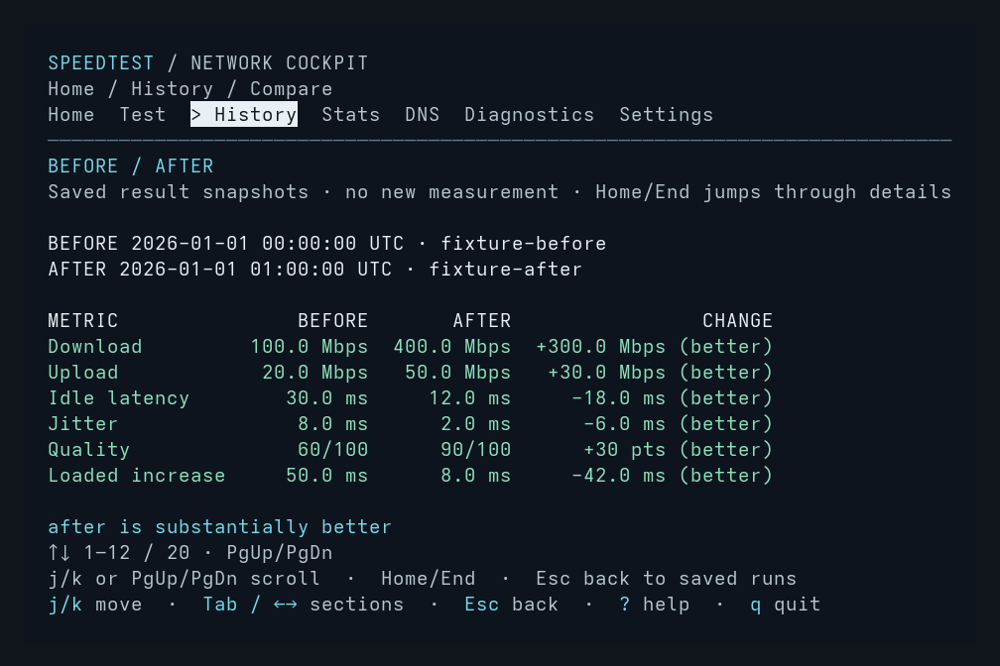
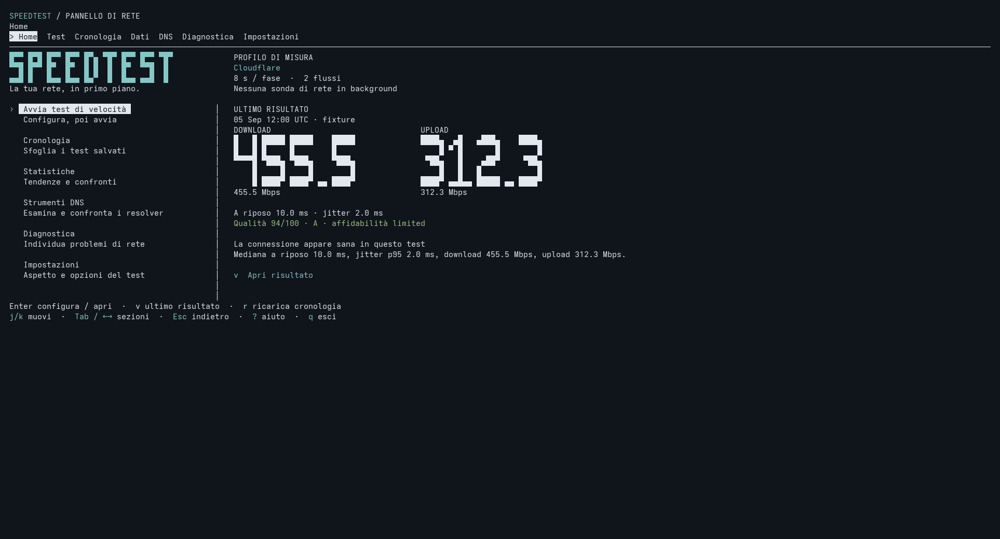

# Frontend and backend improvements

Verified locally on Linux on 2026-09-07, starting from `fc0ed65`, on branch
`cmdr-chara/fullstack-improvements`. The frontend is the existing Ratatui cockpit;
the backend comprises measurement, DNS diagnostics, and persistence.

## Delivered behavior

| Surface | Previous problem | Result |
| --- | --- | --- |
| History navigation | Page keys changed report scroll instead of the selected table row; reload could select a different run | Viewport paging, Home/End, and selection anchored to the complete saved record, including duplicate occurrences |
| Comparison | History comparison always used the newest two runs and omitted quality/bufferbloat evidence | Pin a before baseline with `b`, choose an after run, then press `c`; display both sources and all six metric deltas |
| Presentation | Comparison rows were formatted before translation, with fixed text widths | Translate individual cells, align by terminal-cell width, and stack complete values when columns cannot fit; 23 new entries in each of eight catalogs |
| HTTP uploads | A response completing a long poll past the cutoff could still commit bytes | Shared completion guard checks the deadline before and after response processing; both engines apply the same policy to late request errors |
| LibreSpeed feedback | Loaded-latency summaries were absent until the final result | Publish each phase's loaded-latency event before returning its result |
| LAN server | A semaphore bounded live work but not retained completed tasks | Reap completed tasks before admission and cap the JoinSet itself at 64 |
| DNS validation | Header-only or unrelated answers could count as successful probes | Shared complete-message validation for UDP, DoH, and custom resolvers, with question matching, bounded name decoding, and usable A/CNAME answers |
| DNS transport | UDP truncation could hide a datagram suffix; DoH bodies were accumulated without a wire-size bound | Read complete UDP datagrams and stop DoH body accumulation above 65,535 bytes |
| Persistence | Timestamp collisions overwrote per-run files; concurrent JSONL serialization could interleave | Collision-safe atomic per-run publication, pre-serialized history records, and coordinated readers/writers |
| Exports and history input | Failed in-place writes could damage exports; general saved-result reads lacked the check command's bound | Atomic regular-file replacement, preserved symlink/permission behavior, and a 4 MiB limit per speed-test JSON/history record |

Without a pinned baseline, `c` compares the selected run with its immediately older
neighbor. Baselines and comparison snapshots survive a reload or temporary history
failure. Existing CLI arguments, exit codes, canonical JSON/CSV, offline startup,
session-only settings, and explicit-export-before-history ordering are preserved.

This image renders the application's deterministic Ratatui test buffer at 80×24.
The values and backend labels are synthetic fixtures, not a network measurement.

## Readability follow-up

Continued on 2026-09-08.

The dashboard now uses the terminal width instead of centering itself inside a
120×38 limit. Home keeps the speeds adjacent and its controls near the summary;
the divider ends with the content. Metric digits are five columns wide, with
distinct shapes and a clear decimal point;
enlarged readings also retain an exact ordinary value and unit underneath. Values
that cannot fit remain ordinary text. Home descriptions wrap instead of clipping.

- Results and Statistics group their metrics into adjacent columns. Short results
  keep their divider and controls beside their content; long findings remain scrollable.
- The live dial grows to a bounded size beside its readings instead of stretching
  across most of a wide terminal.
- Sparse histories keep the selected-run preview close to their rows. Longer
  histories retain full-height paging and stable selection.
- Compare shows its verdict and highlight immediately at 80×24 in English and
  Italian. Its six metrics and additional details remain available.
- Built-in comparison terms and result labels are localized before composition;
  the new comparison vocabulary does not translate captured server names.

This is a synthetic 214×52 Ratatui frame, approximating the terminal size in the
readability report. It uses fixture values, not personal history or a new speed
test. The preview fills block characters to their cell boundaries to avoid
artificial font-rasterization seams. Actual body typography and colors follow the
terminal profile.

Additional fixture previews show the [results layout](images/results-readability.png)
and [short-history layout](images/history-readability.png) at the same terminal size.

The follow-up passes 171 Rust tests, formatting, Clippy, the executable build, and
the CLI, real-PTY cockpit, and eight-language localization smoke suites on Linux.
Readability captures cover English and Italian at 80×24, 120×38, and 214×52 in all
four palettes. Regressions check resizing, exact values, oversized glyph fallbacks,
hidden live readings, sparse and long histories, long findings, visible comparison
summaries, and localized labels.

## Initial improvement verification

The original checkout passed 121 Rust tests. The integrated implementation passed
**162 tests: 148 library, 12 executable contracts, and 2 serialization tests**.
There are 41 additional tests. The final fixture-only adjustment was also checked
by the 45-test cockpit suite and regenerated captures.

| Check | Outcome |
| --- | --- |
| `cargo fmt --all -- --check` | Pass |
| `cargo clippy --locked --all-targets --all-features -- -D warnings` | Pass |
| `cargo test --locked --all-features` | Pass, 162 tests |
| `cargo build --locked --bin speedtest` | Pass |
| `python .github/scripts/cli_smoke.py` | Pass |
| `python .github/scripts/cockpit_smoke.py` | Pass, including paging, pinned comparison, and selection-preserving reload |
| `python .github/scripts/localization_smoke.py` | Pass, all eight languages |
| `python .github/scripts/test_package_release.py` | Pass, both test methods and their archive/path cases |
| `cargo package --offline --locked --allow-dirty --no-verify` | Pass; packaging only, not an additional packaged-crate build |
| `git diff --check` | Pass |

The socket tests initially encountered the sandbox's bind restriction and passed
with loopback access. The ordinary packaging command encountered a blocked registry
lookup; the offline command succeeded using the existing dependency cache. No
dependency versions changed: `tempfile` moved from development-only to runtime
dependencies, retaining the existing lockfile resolution. File locking uses the
[standard library APIs](https://doc.rust-lang.org/std/fs/struct.File.html#method.lock)
available since Rust 1.89; contributor guidance continues to require current stable
Rust. This run used Rust/Cargo 1.98.0 and Python 3.14.7.

The Rust and real-PTY checks cover local HTTP/UDP/LAN failures, accounting,
cancellation, terminal restoration, no-save/export behavior, malformed input,
concurrent persistence, all supported languages, and minimum-size rendering.
Independent reviews of the storage and frontend changes found no actionable
introduced issues. The final work remains a local, reviewable change set.

## Scope and limits

- No public speed tests or resolver measurements ran, and no system DNS settings
  were changed. Loopback evidence does not establish WAN calibration.
- This run verifies Linux. Windows/macOS CI and native console behavior still need
  their normal platform checks; no cross-platform execution is claimed here.
- History is bounded per record, not by total archive size. Retention is unchanged.
- File locks require filesystem support and cooperating readers/writers. Exports,
  per-run publication, and history remain separate operations; a later failure may
  leave an earlier completed file available for recovery.
- DNS probes still have no DNSSEC verification or UDP-to-TCP fallback. Negative or
  incomplete responses count as failed probes; scoring formulas are unchanged.

All completion gates passed: repository setup, frontend, engine/LAN, DNS, storage,
documentation, and integrated verification (7/7).
