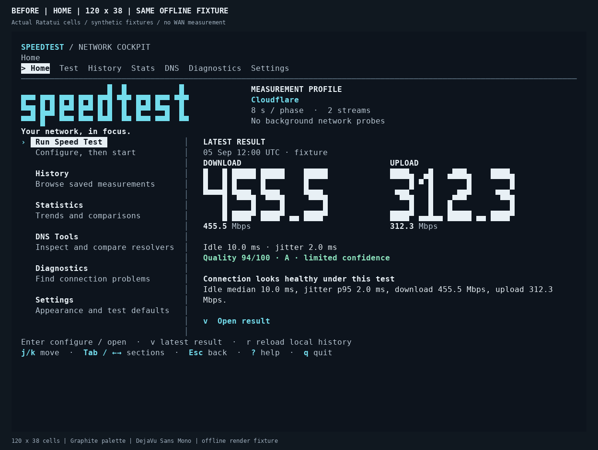
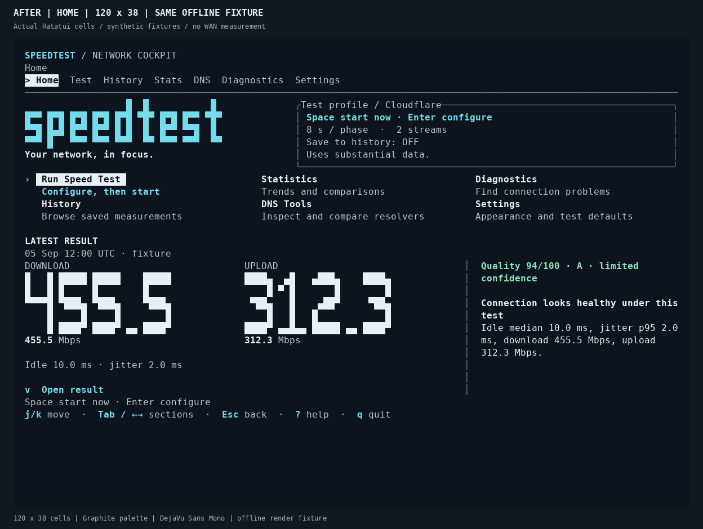
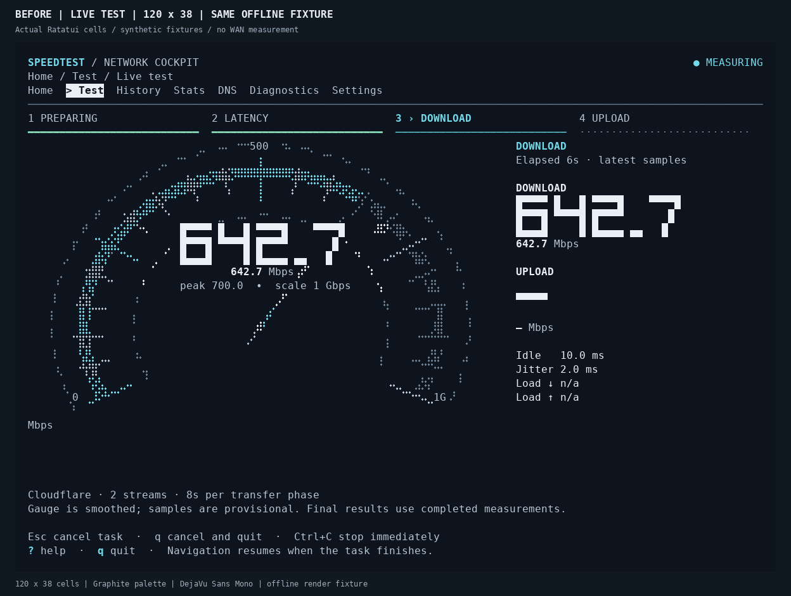
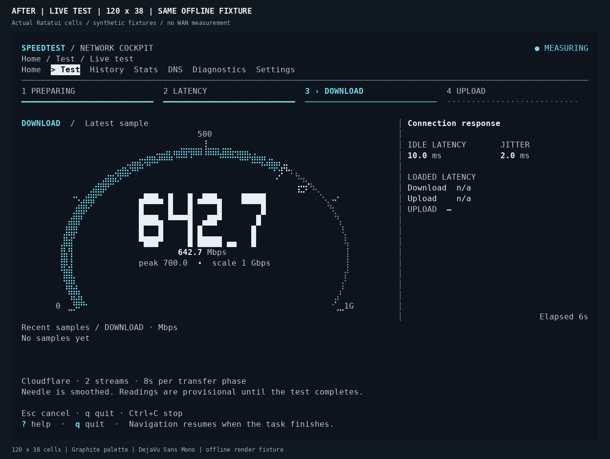
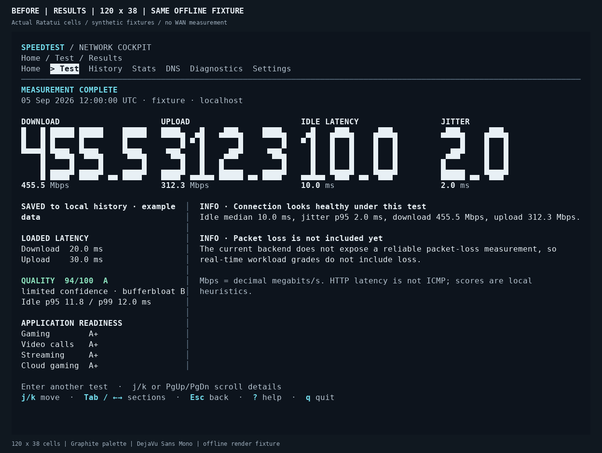
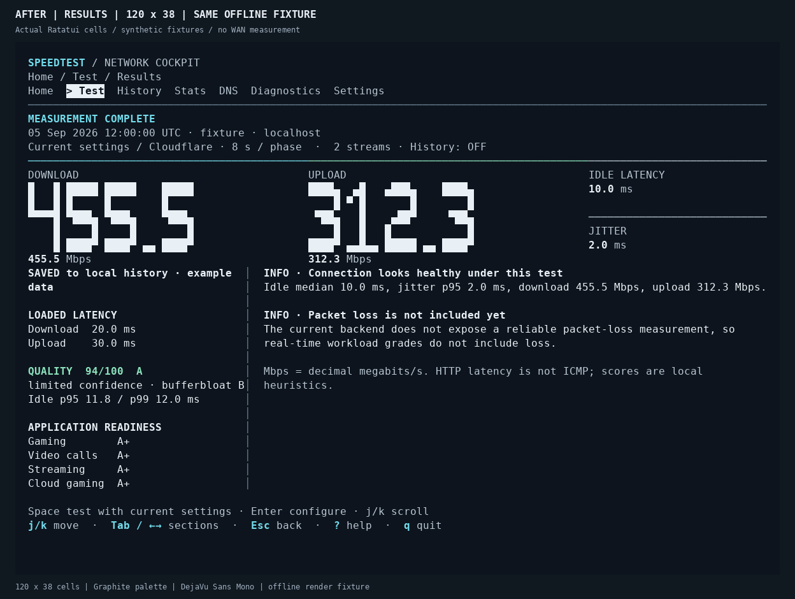
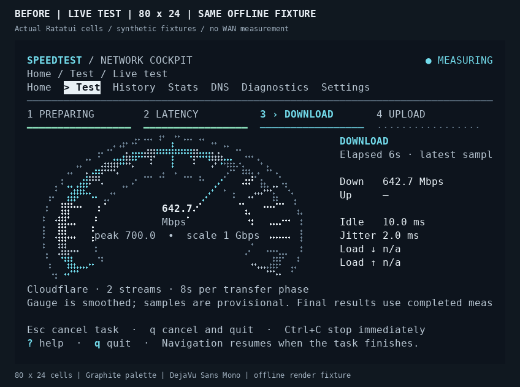
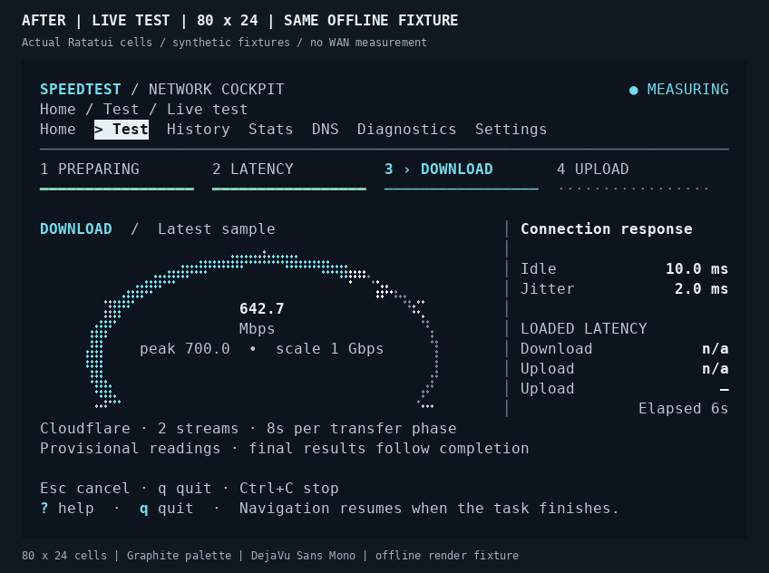
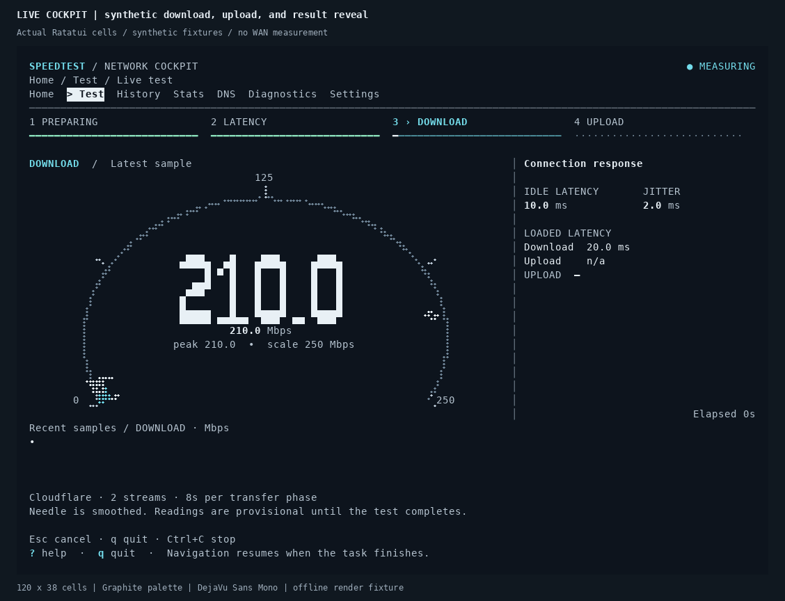

# Cockpit redesign gallery

Screenshots and animation are rasterized from **actual application Ratatui cell
buffers**. They use synthetic offline fixtures, English, and the explicitly chosen
Graphite palette. The application still inherits the terminal's palette by default.

## Before and after

Each pair uses the same saved results, live readings, terminal dimensions, palette,
font, and rasterizer. The Live stills intentionally contain no throughput samples,
matching the existing readability fixture; the animation adds synthetic engine
events. No screenshot represents an Internet-speed measurement.

The baseline source corresponds to published commit
[`26da4a6`](https://github.com/cmdr-chara/speedtest-cli/commit/26da4a6)
from PR #24, before the cockpit redesign.

| View | Before | After |
| --- | --- | --- |
| Home · 120 × 38 |  |  |
| Live · 120 × 38 |  |  |
| Results · 120 × 38 |  |  |
| Live · 80 × 24 |  |  |

## Live motion



The animation captures the actual renderer at 50 ms intervals for five seconds.
Synthetic `EngineEvent` samples drive the live gauge; the fixture switches to
Upload at 1.8 seconds and completes at 3.5 seconds. The rasterizer does not generate
intermediate animation states. Identical adjacent frames may be coalesced in the
GIF without changing timing.

## Reproduce

Before applying the redesign, capture the baseline readability fixtures:

```bash
READABILITY_SNAPSHOT_DIR=/tmp/speedtest-design-before cargo test --locked --lib capture_readability_frames_when_explicitly_requested
```

After applying the redesign, capture the same fixtures and the deterministic
motion sequence, then render this gallery:

```bash
READABILITY_SNAPSHOT_DIR=/tmp/speedtest-design-after cargo test --locked --lib capture_readability_frames_when_explicitly_requested
COCKPIT_MOTION_SNAPSHOT_DIR=/tmp/speedtest-design-motion cargo test --locked --lib capture_motion_frames_when_explicitly_requested
python docs/images/design/render_gallery.py --before-dir /tmp/speedtest-design-before --after-dir /tmp/speedtest-design-after --motion-dir /tmp/speedtest-design-motion
```

`render_gallery.py` imports `../motion/render_motion.py`, including its cell-edge
block/Braille rendering and underline handling. It requires Pillow and DejaVu Sans
Mono. This font belongs to the screenshot renderer; the application does not
change the user's terminal font. PNG retains captured RGB colors; GIF uses a
shared 256-color palette.

These fixtures establish the application's rendered layout and deterministic
animation sequence. They do not establish WAN accuracy, refresh rate on a real
terminal, terminal-specific font behavior, or Windows-console behavior.
