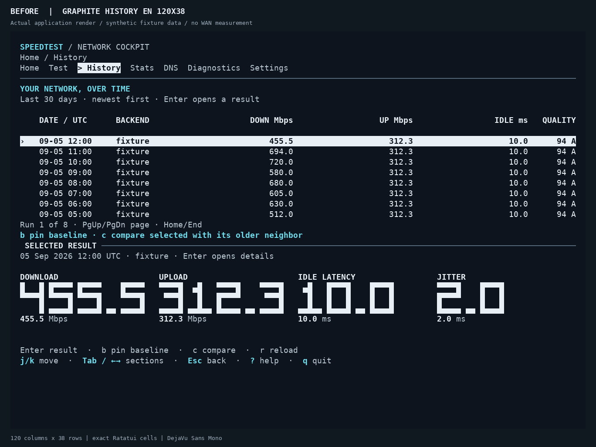
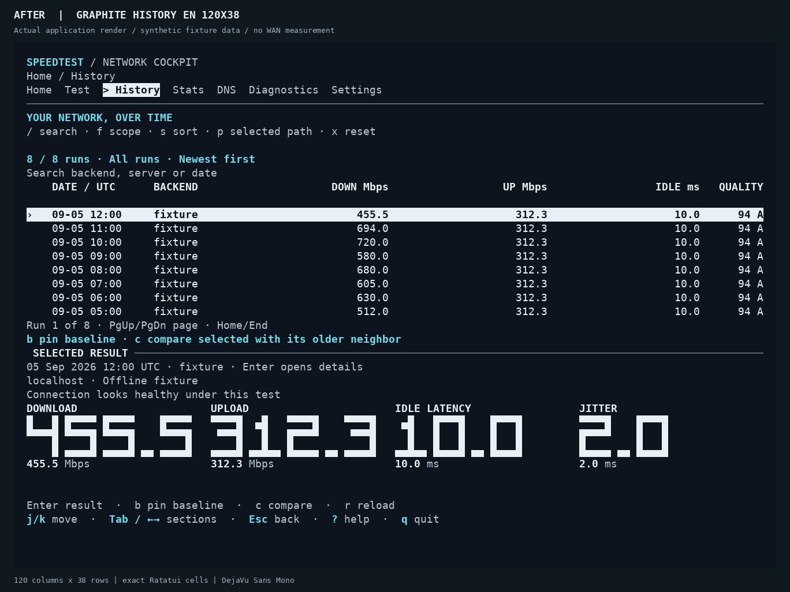
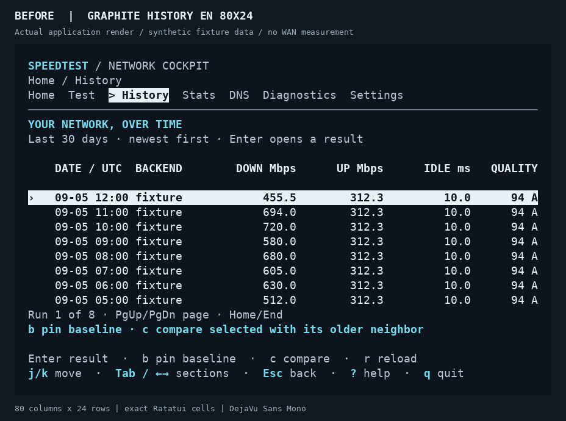
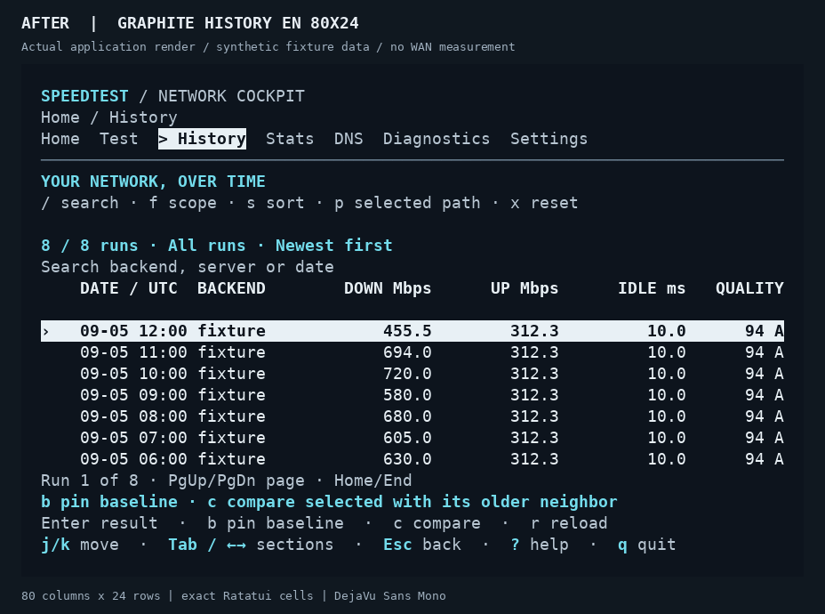
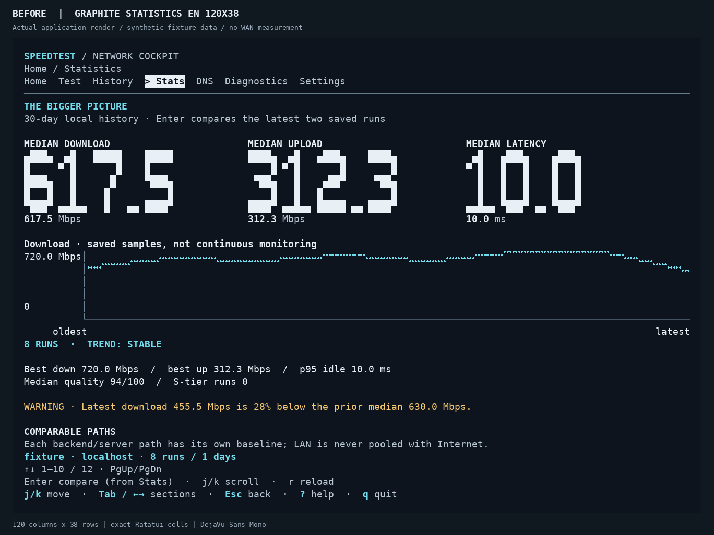
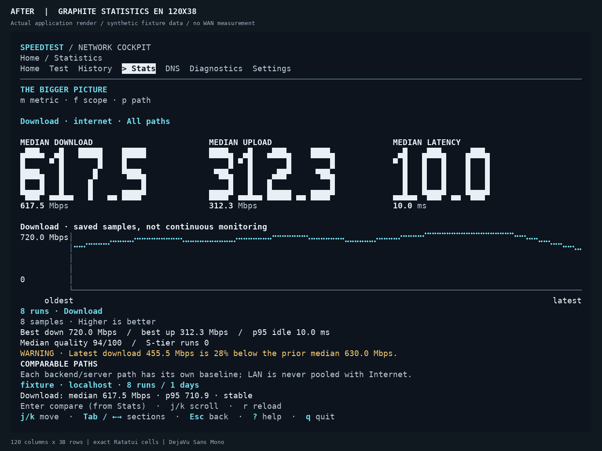
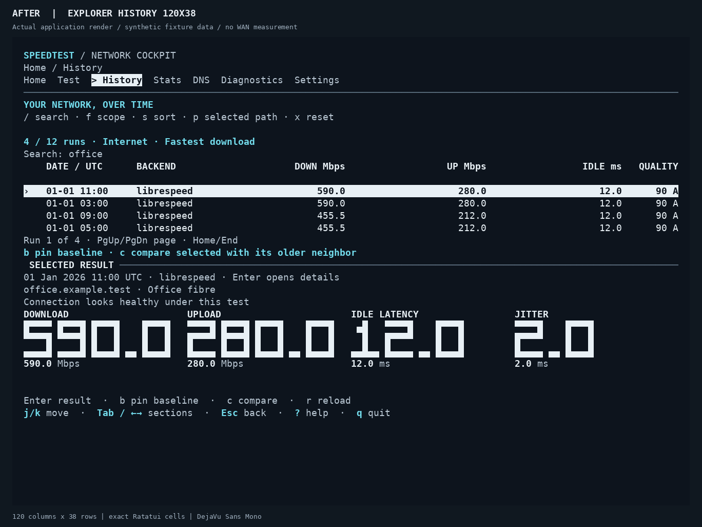
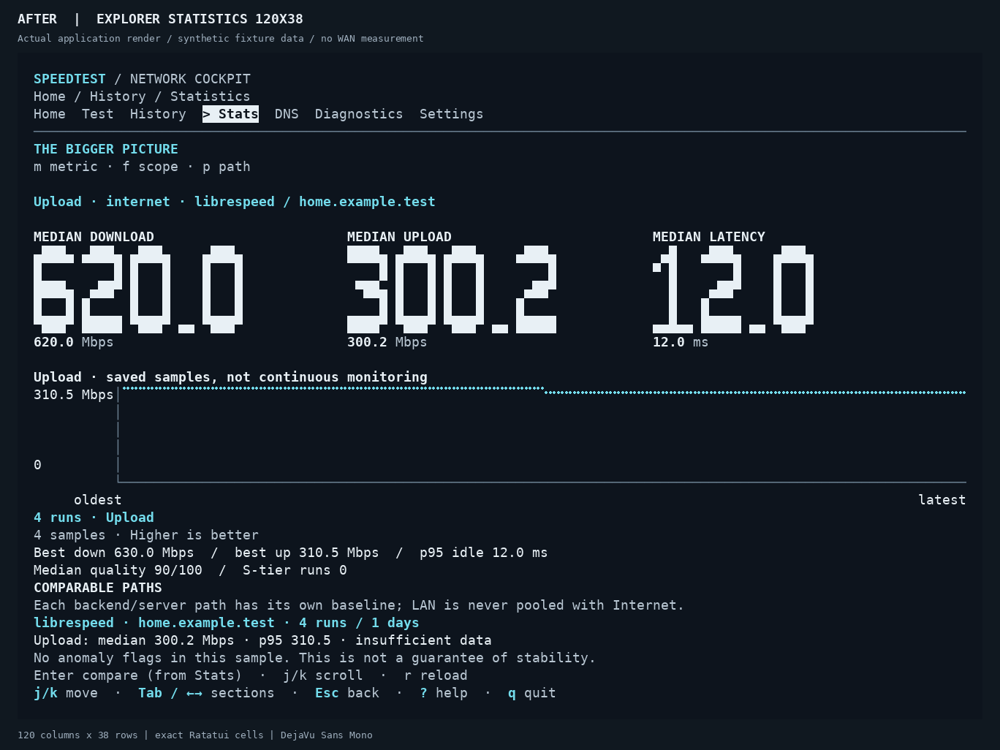

# History explorer: before and after

These are captures of the actual Ratatui renderer using deterministic synthetic
fixtures, not measured Internet speeds. Both sides use the Graphite palette,
English, and the same terminal dimensions. No system settings or user history
were used. The baseline is upstream `59f762f157982443e05436376114c5a71d8fd7cb`.

| View | Before | After |
| --- | --- | --- |
| History, 120 × 38 |  |  |
| History, 80 × 24 |  |  |
| Statistics, 120 × 38 |  |  |

The history toolbar exposes search, scope, sorting, path selection, and reset.
The selected-run preview includes path identity. Statistics can select a metric
and saved path instead of always showing download throughput.

### Active controls





## Reproduce

Run this in separate checkouts of the baseline and candidate, substituting separate
output directories:

```bash
READABILITY_SNAPSHOT_DIR=/tmp/speedtest-frames \
COCKPIT_SNAPSHOT_DIR=/tmp/speedtest-frames \
cargo test --locked --lib capture_ -- --nocapture

python3 docs/images/explorer/render_frames.py --label AFTER \
  --out-dir /tmp/speedtest-png \
  /tmp/speedtest-frames/graphite-history-en-120x38.json \
  /tmp/speedtest-frames/graphite-history-en-80x24.json \
  /tmp/speedtest-frames/graphite-statistics-en-120x38.json
```

The Python rasterizer needs Pillow and DejaVu Sans Mono. It uses each exported cell's
symbol, colors, and modifiers; block elements and Braille chart dots are drawn
directly within their cells. For the
baseline checkout, use the rasterizer from the candidate checkout. Terminal font
rendering can differ across machines; the underlying cell buffers remain the
authoritative layout evidence.

The additional active-control fixtures are exported by setting
`COCKPIT_EXPLORER_SNAPSHOT_DIR` during `cargo test --locked --lib capture_`.
