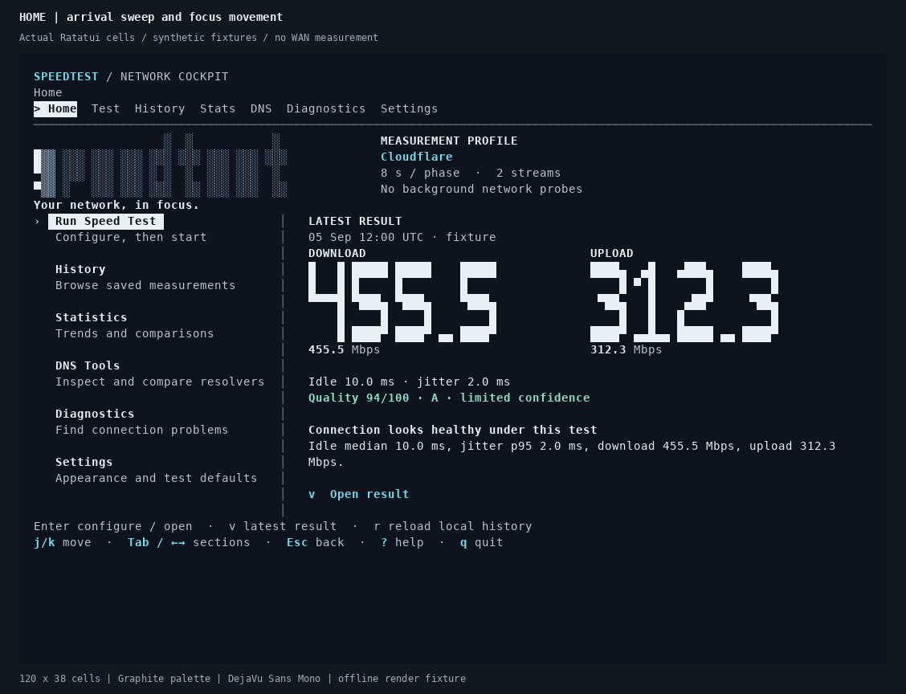
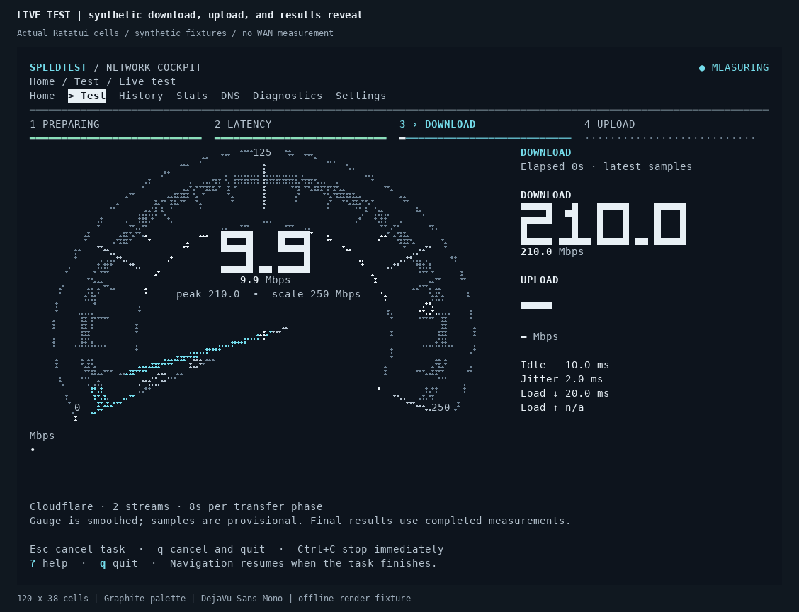
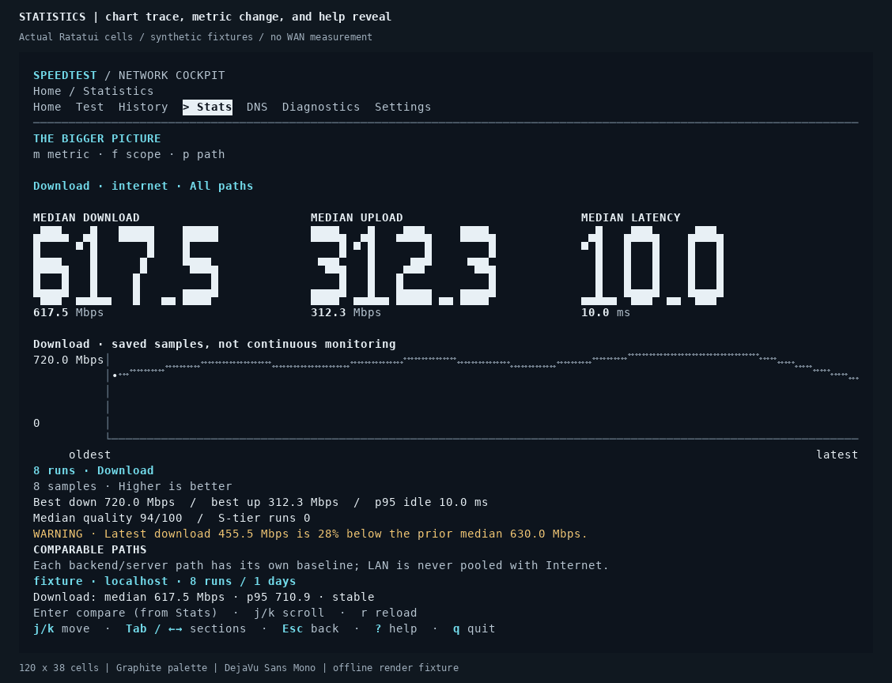
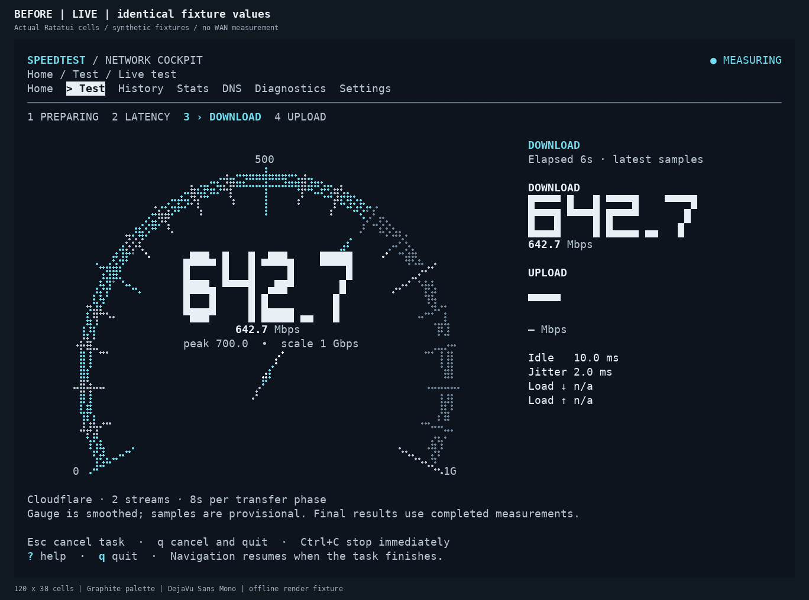
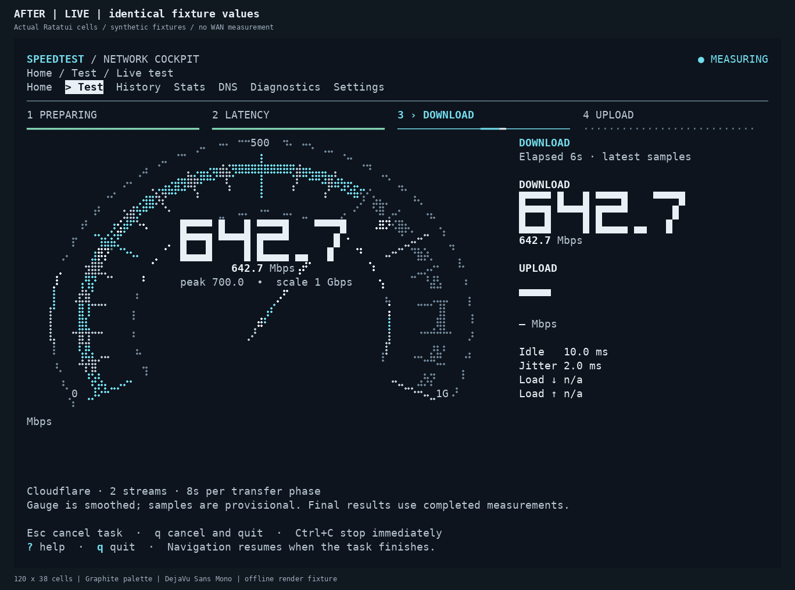
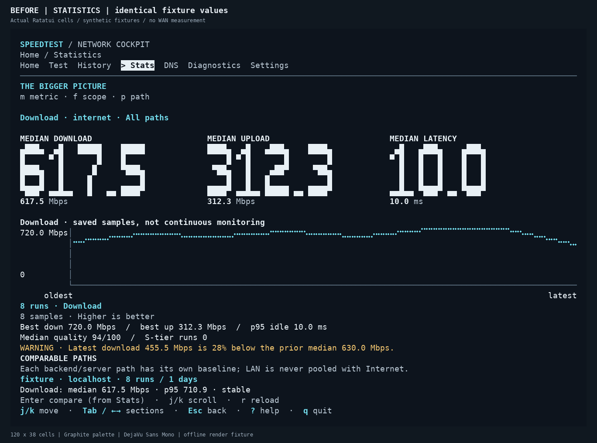
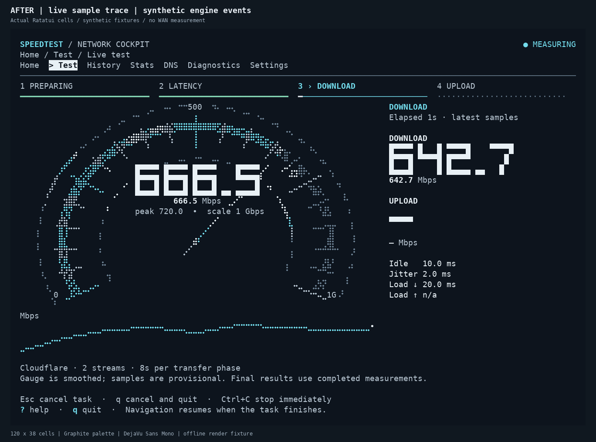

# Cockpit motion gallery

These are **actual Ratatui cell buffers rendered by the application**, with
synthetic offline data at 120 columns × 38 rows. There are no WAN probes, video
mockups, or invented intermediate frames. Graphite is selected explicitly for the
captures; the application continues to inherit the terminal palette by default.

## Motion

The GIFs replay deterministic 50 ms frame steps (20 fps). This is a capture choice,
not a terminal performance claim. They show bounded transitions and live effects;
idle pages settle. Speed samples and final results are deliberately synthetic.
Identical adjacent frames are coalesced by the GIF encoder without changing timing.

### Home arrival and focus



### Download, upload, and result reveal



The fixture injects the same `EngineEvent` variants as the real engine. It changes
to Upload at 1.8 seconds and completes at 3.5 seconds. No bandwidth measurement
takes place. The numeric readings come from those events; they are not counted up
by the rasterizer.

### Statistics and help



## Before and after

These pairs use the same existing readability fixture, values, terminal size,
palette, and rasterizer. The Live pair deliberately has no trace samples, matching
the original fixture; the additional capture below and GIF show sample history.
The baseline source matches published commit
`83f78c0fb13919af634f91237d5f8401a8f681a4`.

| View | Before | After |
| --- | --- | --- |
| Live test |  |  |
| Statistics |  |  |



## Reproduce

Capture the baseline readability frames **before applying the motion changes**:

```bash
READABILITY_SNAPSHOT_DIR=/tmp/speedtest-before cargo test --locked --lib capture_readability_frames_when_explicitly_requested
```

Capture the changed implementation and rasterize its buffers:

```bash
COCKPIT_MOTION_SNAPSHOT_DIR=/tmp/speedtest-motion cargo test --locked --lib capture_motion_frames_when_explicitly_requested
python docs/images/motion/render_motion.py --frames-root /tmp/speedtest-motion --before-dir /tmp/speedtest-before
```

The Python renderer requires Pillow and DejaVu Sans Mono. It shares the block and
Braille cell rasterization code in `../explorer/render_frames.py`. Font choice
belongs to this evidence renderer; it does not change the application's terminal
font. GIF uses a shared 256-color palette; PNG preserves captured RGB colors.
Terminal-specific glyph rendering, refresh rate, and Windows-console behavior are
not established by these buffers.
